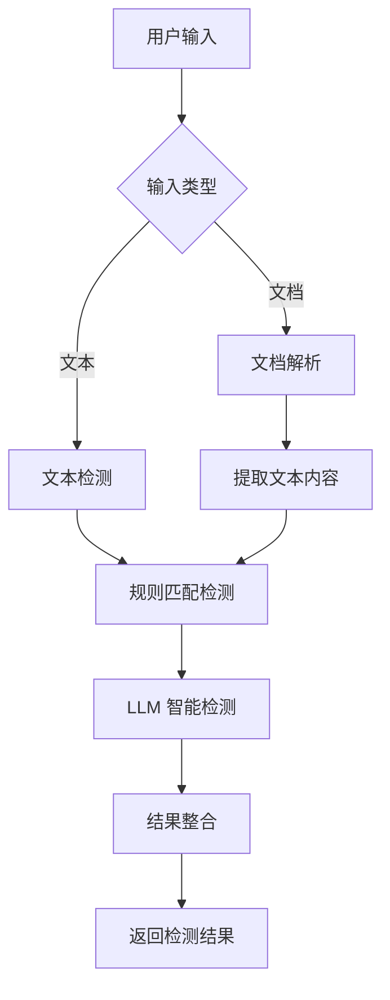

# 敏感词检测系统

一个基于 FastAPI + Ollama 的智能敏感词检测系统，支持文本和文档检测，具备规则匹配和大语言模型双重检测能力。

## 📋 目录

- [项目概述](#项目概述)
- [技术架构](#技术架构)
- [功能特性](#功能特性)
- [快速开始](#快速开始)
- [API 文档](#api-文档)
- [前端界面](#前端界面)
- [配置说明](#配置说明)
- [部署指南](#部署指南)
- [开发指南](#开发指南)
- [故障排除](#故障排除)

## 🎯 项目概述

敏感词检测系统是一个现代化的内容安全检测平台，结合了传统的规则匹配算法和先进的大语言模型技术，为用户提供准确、可靠的敏感内容识别服务。

### 核心价值

- **双重检测**：规则匹配 + LLM 智能检测
- **多格式支持**：文本、PDF、DOCX 文档
- **实时检测**：毫秒级响应时间
- **现代化界面**：简洁美观的 Web 界面
- **容器化部署**：Docker 一键部署

## 🏗️ 技术架构

### 系统架构图

```
┌─────────────────┐    ┌─────────────────┐    ┌─────────────────┐
│   前端界面      │    │   后端 API      │    │   Ollama LLM    │
│   (HTML/CSS/JS) │◄──►│   (FastAPI)     │◄──►│   (qwen:7b)     │
└─────────────────┘    └─────────────────┘    └─────────────────┘
         │                       │                       │
         │                       │                       │
         ▼                       ▼                       ▼
┌─────────────────┐    ┌─────────────────┐    ┌─────────────────┐
│   用户交互       │    │   业务逻辑       │    │   模型推理       │
│   - 文本输入     │    │   - 规则匹配     │    │   - 内容分析     │
│   - 文件上传     │    │   - API 调用     │    │   - 敏感度判断   │
│   - 结果展示     │    │   - 结果整合     │    │   - 结果输出     │
└─────────────────┘    └─────────────────┘    └─────────────────┘
```

### 技术栈

#### 后端技术
- **FastAPI**: 现代化的 Python Web 框架
- **Uvicorn**: ASGI 服务器
- **Pydantic**: 数据验证和序列化
- **PyPDF2**: PDF 文档解析
- **python-docx**: DOCX 文档解析
- **Trie**: 敏感词匹配算法

#### 前端技术
- **HTML5**: 语义化标记
- **CSS3**: 现代化样式设计
- **JavaScript ES6+**: 交互逻辑
- **Fetch API**: HTTP 请求
- **Drag & Drop API**: 文件拖拽上传

#### AI 技术
- **Ollama**: 本地 LLM 运行环境
- **Qwen:7b**: 通义千问 7B 参数模型
- **Prompt Engineering**: 提示词工程优化

#### 部署技术
- **Docker**: 容器化部署
- **Docker Compose**: 多容器编排
- **WSL**: Windows 子系统 Linux

## ✨ 功能特性

### 核心功能

1. **文本检测**
   - 实时文本敏感词检测
   - 规则匹配 + LLM 双重验证
   - 字符计数和输入验证

2. **文档检测**
   - 支持 TXT、PDF、DOCX 格式
   - 文件大小限制（10MB）
   - 拖拽上传支持

3. **智能检测**
   - 基于 Trie 树的敏感词匹配
   - 大语言模型内容理解
   - 检测结果一致性保证

4. **用户界面**
   - 响应式设计
   - 标签页切换
   - 实时通知系统
   - 键盘快捷键支持

### 检测流程



## 🚀 快速开始

### 环境要求

- Docker & Docker Compose
- WSL (Windows 用户)
- 8GB+ 内存 (运行 qwen:7b 模型)

### 安装步骤

1. **克隆项目**
   ```bash
   git clone https://gitee.com/saisai5203/sensitive-detector-v1.0.0.git
   cd sensitive-detector
   ```

2. **启动 Ollama 服务**
   ```bash
   # 在 WSL 中启动 Ollama
   export OLLAMA_HOST=0.0.0.0:11434
   ollama serve
   
   # 下载 qwen:7b 模型
   ollama pull qwen:7b
   ```

3. **启动项目**
   ```bash
   docker compose up -d
   ```

4. **访问系统**
   - 前端界面: http://localhost:8000
   - API 文档: http://localhost:8000/api/docs

## 📚 API 文档

### 基础信息

- **Base URL**: `http://localhost:8000`
- **Content-Type**: `application/json`
- **字符编码**: UTF-8

### 接口列表

#### 1. 文本检测

**接口地址**: `POST /detect/text`

**请求参数**:
```json
{
  "text": "需要检测的文本内容"
}
```

**响应格式**:
```json
{
  "success": true,
  "data": {
    "original_text": "原始文本",
    "rule_detected": ["敏感词1", "敏感词2"],
    "llm_detected": "敏感",
    "final_result": "敏感"
  }
}
```

**状态码**:
- `200`: 检测成功
- `400`: 请求参数错误
- `500`: 服务器内部错误

#### 2. 文档检测

**接口地址**: `POST /detect/document`

**请求参数**: `multipart/form-data`
- `file`: 上传的文档文件

**响应格式**:
```json
{
  "success": true,
  "data": {
    "filename": "document.pdf",
    "file_type": "pdf",
    "text_length": 10000,
    "rule_detected": [],
    "llm_detected": "正常",
    "final_result": "正常"
  }
}
```

#### 3. 健康检查

**接口地址**: `GET /health`

**响应格式**:
```json
{
  "status": "healthy",
  "timestamp": "2025-01-01T00:00:00Z"
}
```

### 错误处理

所有接口遵循统一的错误响应格式：

```json
{
  "success": false,
  "error": {
    "code": "ERROR_CODE",
    "message": "错误描述",
    "details": "详细错误信息"
  }
}
```

## 🎨 前端界面

### 界面结构

```
敏感词检测系统
├── 顶部导航栏
│   ├── 系统标题
│   └── 标签页切换
├── 文本检测标签页
│   ├── 文本输入区域
│   ├── 字符计数显示
│   ├── 检测按钮
│   └── 检测结果展示
└── 文档检测标签页
    ├── 文件上传区域
    ├── 拖拽上传支持
    ├── 文件信息显示
    ├── 检测按钮
    └── 检测结果展示
```

### 交互特性

1. **响应式设计**
   - 适配桌面和移动设备
   - 弹性布局和媒体查询

2. **用户体验优化**
   - 加载状态指示
   - 实时通知系统
   - 平滑滚动动画
   - 键盘快捷键支持

3. **文件处理**
   - 拖拽上传
   - 文件类型验证
   - 文件大小限制
   - 上传进度显示

### 样式设计

- **设计风格**: 现代化扁平设计
- **色彩方案**: 蓝色主题，绿色/红色状态指示
- **字体**: 系统默认字体栈
- **图标**: Font Awesome 图标库

## ⚙️ 配置说明

### 环境变量

| 变量名 | 默认值 | 说明 |
|--------|--------|------|
| `OLLAMA_BASE_URL` | `http://172.20.0.1:11434` | Ollama 服务地址 |
| `OLLAMA_MODEL` | `qwen:7b` | 使用的 LLM 模型 |
| `CORS_ALLOW_ORIGINS` | `*` | CORS 允许的源 |
| `PYTHONUNBUFFERED` | `1` | Python 输出缓冲 |

### 敏感词配置

敏感词库文件: `backend/sensitive_words.txt`

格式要求:
- 每行一个敏感词
- UTF-8 编码
- 支持中文和英文

示例:
```
敏感词1
敏感词2
sensitive_word
```

### Docker 配置

#### docker-compose.yml 关键配置

```yaml
services:
  sensitive-detector-backend:
    build: ./backend
    container_name: sensitive-detector
    ports:
      - "8000:8000"
    volumes:
      - ./backend/sensitive_words.txt:/app/sensitive_words.txt
      - ./frontend:/app/frontend
    environment:
      - OLLAMA_BASE_URL=http://172.20.0.1:11434
      - OLLAMA_MODEL=qwen:7b
    restart: unless-stopped
```

## 🚢 部署指南

### 快速部署 (推荐)

**一键部署**:
```bash
# 1. 下载 Gitee 部署脚本
wget https://gitee.com/saisai5203/sensitive-detector-v1.0.0/raw/master/scripts/gitee-deploy.sh

# 2. 执行部署
chmod +x gitee-deploy.sh
./gitee-deploy.sh

# 3. 访问系统
# 浏览器打开: http://localhost:8000
```

### 手动部署

1. **服务器要求**
   - Ubuntu 20.04+ 或 CentOS 8+
   - Docker 20.10+
   - Docker Compose 2.0+
   - 8GB+ 内存 (推荐 16GB)
   - 20GB+ 磁盘空间

2. **部署步骤**
   ```bash
   # 1. 安装 Docker
   curl -fsSL https://get.docker.com -o get-docker.sh
   sh get-docker.sh
   
   # 2. 安装 Docker Compose
   sudo curl -L "https://github.com/docker/compose/releases/download/v2.20.0/docker-compose-$(uname -s)-$(uname -m)" -o /usr/local/bin/docker-compose
   sudo chmod +x /usr/local/bin/docker-compose
   
   # 3. 启动 Ollama 服务
   curl -fsSL https://ollama.ai/install.sh | sh
   ollama serve &
   ollama pull qwen:7b
   
   # 4. 部署应用
   git clone https://gitee.com/your-username/sensitive-detector.git
   cd sensitive-detector
   docker compose up -d
   ```

3. **Nginx 反向代理** (可选)
   ```nginx
   server {
       listen 80;
       server_name your-domain.com;
       
       location / {
           proxy_pass http://localhost:8000;
           proxy_set_header Host $host;
           proxy_set_header X-Real-IP $remote_addr;
           proxy_set_header X-Forwarded-For $proxy_add_x_forwarded_for;
       }
   }
   ```

### Docker 打包移植

详细的 Docker 打包移植指南请参考 [Docker 部署文档](docs/DOCKER_DEPLOYMENT.md)，包括：
- 多阶段构建优化
- 镜像打包策略
- 一键部署脚本
- 部署注意事项
- 故障排除指南

### Gitee 部署（国内用户）

由于网络访问限制，国内用户推荐使用 Gitee 部署，详细指南请参考 [Gitee 部署文档](docs/GITEE_DEPLOYMENT.md)，包括：
- Gitee 仓库配置
- 国内网络优化
- 镜像加速配置
- 故障排除指南

### 监控和维护

1. **日志查看**
   ```bash
   docker compose logs -f sensitive-detector-backend
   ```

2. **服务状态检查**
   ```bash
   docker compose ps
   curl http://localhost:8000/health
   ```

3. **性能监控**
   - 内存使用: `docker stats sensitive-detector`
   - API 响应时间: 通过日志分析
   - LLM 推理时间: 通过日志分析

## 🛠️ 开发指南

### 开发环境搭建

1. **本地开发环境**
   ```bash
   # 1. 安装 Python 3.10+
   sudo apt update
   sudo apt install python3.10 python3.10-venv
   
   # 2. 创建虚拟环境
   python3.10 -m venv venv
   source venv/bin/activate
   
   # 3. 安装依赖
   pip install -r backend/requirements.txt
   
   # 4. 启动 Ollama
   ollama serve &
   ollama pull qwen:7b
   
   # 5. 启动后端服务
   cd backend
   uvicorn main:app --reload --host 0.0.0.0 --port 8000
   
   # 6. 启动前端服务 (新终端)
   cd frontend
   python -m http.server 3000
   ```

2. **代码结构**
   ```
   sensitive-detector/
   ├── backend/
   │   ├── main.py              # FastAPI 应用主文件
   │   ├── requirements.txt     # Python 依赖
   │   ├── Dockerfile          # Docker 构建文件
   │   └── sensitive_words.txt # 敏感词库
   ├── frontend/
   │   ├── index.html          # 主页面
   │   ├── style.css           # 样式文件
   │   └── script.js           # 交互逻辑
   ├── docker-compose.yml      # Docker 编排文件
   └── README.md              # 项目文档
   ```

### 代码规范

1. **Python 代码规范**
   - 遵循 PEP 8 标准
   - 使用类型注解
   - 函数和类添加文档字符串
   - 使用 Black 代码格式化

2. **JavaScript 代码规范**
   - 使用 ES6+ 语法
   - 使用 const/let 替代 var
   - 函数使用箭头函数
   - 添加适当的注释

3. **Git 提交规范**
   - feat: 新功能
   - fix: 修复问题
   - docs: 文档更新
   - style: 代码格式调整
   - refactor: 代码重构
   - test: 测试相关
   - chore: 构建过程或辅助工具的变动

### 测试指南

1. **API 测试**
   ```bash
   # 文本检测测试
   curl -X POST "http://localhost:8000/detect/text" \
        -H "Content-Type: application/json" \
        -d '{"text":"测试文本"}'
   
   # 文档检测测试
   curl -X POST "http://localhost:8000/detect/document" \
        -F "file=@test.pdf"
   ```

2. **前端测试**
   - 浏览器兼容性测试
   - 响应式设计测试
   - 交互功能测试
   - 性能测试

## 🔧 故障排除

### 常见问题

#### 1. Ollama 连接失败

**问题**: `Ollama API 调用失败`

**解决方案**:
```bash
# 检查 Ollama 服务状态
ps aux | grep ollama

# 重启 Ollama 服务
pkill ollama
export OLLAMA_HOST=0.0.0.0:11434
ollama serve &

# 检查网络连接
curl http://localhost:11434/api/tags
```

#### 2. Docker 容器无法启动

**问题**: 容器启动失败

**解决方案**:
```bash
# 查看容器日志
docker compose logs sensitive-detector-backend

# 重新构建镜像
docker compose down
docker compose build --no-cache
docker compose up -d
```

#### 3. 前端资源加载失败

**问题**: CSS/JS 文件 404 错误

**解决方案**:
```bash
# 检查文件路径
ls -la frontend/

# 检查 Docker 挂载
docker compose exec sensitive-detector-backend ls -la /app/frontend/

# 重启容器
docker compose restart
```

#### 4. LLM 检测结果不一致

**问题**: 相同输入产生不同结果

**解决方案**:
```python
# 检查 temperature 参数
# 在 backend/main.py 中确保 temperature=0

# 检查模型状态
curl -X POST http://localhost:11434/api/generate \
     -H "Content-Type: application/json" \
     -d '{"model": "qwen:7b", "prompt": "测试", "stream": false}'
```

### 性能优化

1. **LLM 性能优化**
   - 使用 GPU 加速 (如果可用)
   - 调整模型参数
   - 实现结果缓存

2. **API 性能优化**
   - 添加请求限流
   - 实现异步处理
   - 优化数据库查询

3. **前端性能优化**
   - 资源压缩
   - 缓存策略
   - 懒加载实现

### 安全考虑

1. **输入验证**
   - 文件类型检查
   - 文件大小限制
   - 内容长度限制

2. **API 安全**
   - CORS 配置
   - 请求频率限制
   - 错误信息过滤

3. **部署安全**
   - HTTPS 配置
   - 防火墙设置
   - 定期安全更新

## 📞 技术支持

### 联系方式

- **项目维护者**: [维护者姓名]
- **邮箱**: [维护者邮箱]
- **Gitee**: https://gitee.com/saisai5203/sensitive-detector

### 贡献指南

1. Fork 项目仓库
2. 创建功能分支
3. 提交代码更改
4. 创建 Pull Request
5. 等待代码审查

### 许可证

本项目采用 MIT 许可证，详情请参阅 [LICENSE](LICENSE) 文件。

---

**最后更新**: 2025年1月
**版本**: v1.0.0
