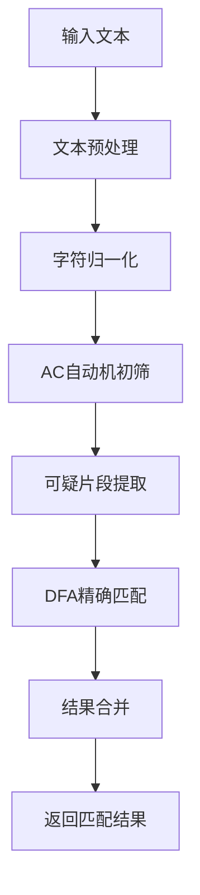

# 敏感词检测系统

一个基于 FastAPI + Ollama 的智能敏感词检测系统，支持文本和文档检测，具备规则匹配和大语言模型双重检测能力。

项目已上传 https://github.com/martingoodmorning/sensitive-detector-v1.0.0.git

## 📋 目录

- [项目概述](#项目概述)
- [技术架构](#技术架构)
- [功能特性](#功能特性)
- [快速开始](#快速开始)
- [API 文档](#api-文档)
- [前端界面](#前端界面)
- [配置说明](#配置说明)
- [部署指南](#部署指南)
- [开发指南](#开发指南)
- [故障排除](#故障排除)
- [技术文档](#技术文档)

## 🎯 项目概述

敏感词检测系统是一个现代化的内容安全检测平台，结合了传统的规则匹配算法和先进的大语言模型技术，为用户提供准确、可靠的敏感内容识别服务。

### 核心价值

- **双重检测**：规则匹配快速筛选 + 存疑内容LLM智能检测
- **多格式支持**：文本、PDF、DOCX、DOC 文档 + 图片OCR识别
- **实时检测**：毫秒级响应时间。单个语句正常响应时间约5ms，存疑内容单次响应时间约450ms，连续响应时间约150ms，适用于实时性要求高场景。
- **支持严格模式**：取消规则匹配快速预筛，所有输入均使用大模型检测，适用于检测率要求高的场景。
- **敏感词库管理**：支持敏感词库选择、构建、编辑、移除等功能，操作简洁友好。
- **大模型优化**：LLM使用Qwen7B INT4量化模型
- **Web界面**：简洁美观的 Web 界面
- **容器化部署**：Docker 一键部署

## 🏗️ 技术架构

### 系统架构图

```
┌─────────────────┐    ┌─────────────────┐    ┌─────────────────┐
│   前端界面      │    │   后端 API      │    │   Ollama LLM    │
│   (HTML/CSS/JS) │◄──►│   (FastAPI)     │◄──►│   (qwen2.5:7b)  │
└─────────────────┘    └─────────────────┘    └─────────────────┘
         │                       │                       │
         │                       │                       │
         ▼                       ▼                       ▼
┌─────────────────┐    ┌─────────────────┐    ┌─────────────────┐
│   用户交互       │    │   业务逻辑       │    │   模型推理       │
│   - 文本输入     │    │   - 规则匹配     │    │   - 内容分析     │
│   - 文件上传     │    │   - API 调用     │    │   - 敏感度判断   │
│   - 结果展示     │    │   - 结果整合     │    │   - 结果输出     │
└─────────────────┘    └─────────────────┘    └─────────────────┘
```

### 技术栈

#### 后端技术
- **FastAPI**: 现代化的 Python Web 框架
- **Uvicorn**: ASGI 服务器
- **Pydantic**: 数据验证和序列化
- **PyPDF2**: PDF 文档解析
- **python-docx**: DOCX 文档解析
- **antiword**: DOC 文档解析工具
- **pytesseract**: OCR 文字识别
- **Tesseract OCR**: 图片文字识别引擎
- **AC自动机**: 多模式字符串匹配算法
- **DFA**: 确定性有限自动机
- **文本预处理**: 字符归一化和变体统一

#### 前端技术
- **HTML5**: 语义化标记
- **CSS3**: 现代化样式设计
- **JavaScript ES6+**: 交互逻辑
- **Fetch API**: HTTP 请求
- **Drag & Drop API**: 文件拖拽上传

#### AI 技术
- **Ollama**: 本地 LLM 运行环境
- **Qwen2.5:7b**: 通义千问 2.5 版本 7B 参数模型（量化版本）
- **Prompt Engineering**: 提示词工程优化

#### 部署技术
- **Docker**: 容器化部署
- **Docker Compose**: 多容器编排
- **WSL**: Windows 子系统 Linux

## ✨ 功能特性

### 核心功能

1. **文本检测**
   - 实时文本敏感词检测
   - 默认模式：规则匹配快速筛选 + 存疑内容大模型检测
   - 严格模式：跳过规则匹配，直接使用大模型检测
   - 字符计数和输入验证

2. **文档检测**
   - 支持 TXT、PDF、DOCX、DOC 格式
   - 支持图片OCR识别（JPG、PNG、BMP、GIF、TIFF）
   - 文件大小限制（10MB）
   - 字符限制（10000个字符）
   - 拖拽上传支持
   - 严格模式：直接使用大模型检测

3. **智能检测**
   - 基于 AC自动机 + DFA 的敏感词匹配
   - 大语言模型内容理解
   - 检测结果一致性保证

4. **用户界面**
   - 响应式设计
   - 标签页切换
   - 实时通知系统
   - 键盘快捷键支持

### 检测流程

#### 文本检测流程


#### 文档检测流程


#### 规则匹配检测详细流程



#### 检测模式说明

**普通模式（默认）**：
- 先使用规则匹配进行快速筛选
- 如果发现敏感词，再使用LLM进行智能检测
- 如果未发现敏感词，直接返回"正常"结果
- 响应时间：5ms（规则匹配）+ 450ms（LLM检测，仅在发现敏感词时）

**严格模式**：
- 跳过规则匹配，直接使用LLM检测所有内容
- 适用于检测率要求高的场景
- 响应时间：450ms（所有内容都经过LLM检测）

**文档检测**：
- 默认使用严格模式（所有文档内容都经过LLM检测）
- 支持多种格式：TXT、PDF、DOCX、DOC、图片OCR
- 文件大小限制：10MB
- 文本长度限制：10000个字符

## 🚀 快速开始

### 环境要求

- Docker & Docker Compose
- 8GB+ 内存 (运行 qwen2.5:7b 量化模型)
- 20GB+ 磁盘空间

### 一键启动

```bash
# 1. 克隆项目
git clone https://github.com/martingoodmorning/sensitive-detector-v1.0.0.git
cd sensitive-detector

# 2. 一键启动所有服务
docker-compose up -d

# 3. 等待服务启动（首次启动需要下载模型，约5-10分钟）
# 查看启动进度
docker-compose logs -f

# 4. 访问系统
# 前端界面: http://localhost:8000
# API 文档: http://localhost:8000/docs
# 健康检查: http://localhost:8000/health
```

**系统会自动**：
- ✅ 拉取 Ollama 镜像
- ✅ 启动 Ollama 服务
- ✅ 检查并下载 Qwen 模型
- ✅ 启动应用服务
- ✅ 进行模型预热

详细部署说明请参考 [部署指南](#部署指南)。

## 📚 API 文档

### 基础信息

- **Base URL**: `http://localhost:8000`
- **Content-Type**: `application/json`
- **字符编码**: UTF-8

### 接口列表

#### 1. 文本检测

**接口地址**: `POST /detect/text`

**请求参数**:
```json
{
  "text": "需要检测的文本内容"
}
```

**响应格式**:
```json
{
  "success": true,
  "data": {
    "original_text": "原始文本",
    "rule_detected": ["敏感词1", "敏感词2"],
    "llm_detected": "敏感",
    "final_result": "敏感"
  }
}
```

**状态码**:
- `200`: 检测成功
- `400`: 请求参数错误
- `500`: 服务器内部错误

#### 2. 文档检测

**接口地址**: `POST /detect/document`

**请求参数**: `multipart/form-data`
- `file`: 上传的文档文件

**响应格式**:
```json
{
  "success": true,
  "data": {
    "filename": "document.pdf",
    "file_type": "pdf",
    "text_length": 10000,
    "rule_detected": [],
    "llm_detected": "正常",
    "final_result": "正常"
  }
}
```

#### 3. 健康检查

**接口地址**: `GET /health`

**响应格式**:
```json
{
  "status": "healthy",
  "timestamp": "2025-01-01T00:00:00Z"
}
```

### 错误处理

所有接口遵循统一的错误响应格式：

```json
{
  "success": false,
  "error": {
    "code": "ERROR_CODE",
    "message": "错误描述",
    "details": "详细错误信息"
  }
}
```

## 🎨 前端界面

### 界面结构

```
敏感词检测系统
├── 顶部导航栏
│   ├── 系统标题
│   └── 标签页切换
├── 文本检测标签页
│   ├── 文本输入区域
│   ├── 严格模式选择
│   ├── 字符计数显示
│   ├── 检测按钮
│   └── 检测结果展示
├── 文档检测标签页
│   ├── 文件上传区域
│   ├── 拖拽上传支持
│   ├── 文件信息显示
│   ├── 检测按钮
│   └── 检测结果展示
└── 词库管理标签页
    ├── 使用词库列表
    │   ├── 已选词库显示
    │   ├── 词库统计信息
    │   └── 更新检测词库按钮
    ├── 词库列表管理
    │   ├── 词库列表显示
    │   ├── 创建新词库按钮
    │   ├── 编辑词库功能
    │   └── 删除词库功能
    └── 词库编辑器
        ├── 词库名称输入
        ├── 敏感词列表编辑
        ├── 敏感词计数显示
        └── 保存/取消按钮
```

### 交互特性

1. **响应式设计**
   - 适配桌面和移动设备
   - 弹性布局和媒体查询

2. **用户体验优化**
   - 加载状态指示
   - 实时通知系统
   - 平滑滚动动画
   - 键盘快捷键支持

3. **文件处理**
   - 拖拽上传
   - 文件类型验证
   - 文件大小限制
   - 上传进度显示

### 样式设计

- **设计风格**: 现代化扁平设计
- **色彩方案**: 蓝色主题，绿色/红色状态指示
- **字体**: 系统默认字体栈
- **图标**: Font Awesome 图标库

## ⚙️ 配置说明

### 环境变量

| 变量名 | 默认值 | 说明 |
|--------|--------|------|
| `OLLAMA_BASE_URL` | `http://ollama:11434` | Ollama 服务地址（容器内） |
| `OLLAMA_MODEL` | `qwen2.5:7b-instruct-q4_K_M` | 使用的 LLM 模型（推荐量化版本） |
| `CORS_ALLOW_ORIGINS` | `*` | CORS 允许的源 |
| `PYTHONUNBUFFERED` | `1` | Python 输出缓冲 |
| `HEALTH_CHECK_ENABLED` | `true` | 启用健康检查 |

### Docker 配置


```yaml
services:
  ollama:
    image: ollama/ollama:latest
    container_name: ollama-service
    ports:
      - "11434:11434"
    volumes:
      - ollama_data:/root/.ollama
    environment:
      - OLLAMA_HOST=0.0.0.0
    deploy:
      resources:
        limits:
          memory: 8G
          cpus: '4.0'
    healthcheck:
      test: ["CMD", "ollama", "list"]
      interval: 30s
      timeout: 10s
      retries: 3

  sensitive-detector:
    build: ./backend
    container_name: sensitive-detector
    ports:
      - "8000:8000"
    volumes:
      - ./frontend:/app/frontend
      - ./word_libraries:/app/word_libraries
      - ./detection_config.json:/app/detection_config.json
    environment:
      - OLLAMA_BASE_URL=http://ollama:11434
      - OLLAMA_MODEL=qwen2.5:7b-instruct-q4_K_M
    depends_on:
      ollama:
        condition: service_healthy
    deploy:
      resources:
        limits:
          memory: 2G
          cpus: '1.0'

volumes:
  ollama_data:
    driver: local
    device: ./data/ollama
```

**优势**：
- ✅ 完全容器化，无需外部依赖
- ✅ 数据持久化存储
- ✅ 资源限制和健康检查
- ✅ 服务依赖管理
- ✅ 适合生产环境部署


### 量化模型配置

**推荐使用量化的Qwen模型以提升性能：**

| 模型 | 大小 | 内存占用 | 适用场景 |
|------|------|----------|----------|
| `qwen2.5:7b-instruct-q4_K_M` | ~4.1GB | ~6GB | 生产环境（推荐） |
| `qwen2.5:3b-instruct-q4_K_M` | ~1.9GB | ~3GB | 开发测试 |
| `qwen2.5:1.5b-instruct-q4_K_M` | ~0.9GB | ~2GB | 资源受限环境 |


**下载量化模型：**
```bash
# 推荐使用7B INT4量化版本
ollama pull qwen2.5:7b-instruct-q4_K_M

# 或使用更轻量的3B版本
ollama pull qwen2.5:3b-instruct-q4_K_M
```

详细配置请参考：[生产环境部署指南](docs/PRODUCTION_DEPLOYMENT.md)

### 敏感词配置

**默认词库位置**: `word_libraries/` 目录

系统会自动使用 `word_libraries/` 目录中的所有 `.txt` 文件作为默认词库。如果目录为空，系统会自动创建一个包含基础敏感词的默认词库。

**词库格式要求**:
- 每行一个敏感词
- UTF-8 编码
- 支持中文和英文
- 文件扩展名必须为 `.txt`

**词库文件示例** (`word_libraries/政治敏感词.txt`):
```
法西斯
纳粹
极端主义
恐怖主义
```

**词库文件示例** (`word_libraries/暴力词汇.txt`):
```
暴力
辱骂
威胁
伤害
```

### 故障排除

#### 常见问题

1. **容器启动失败**
   ```bash
   # 检查容器状态
   docker-compose ps
   
   # 查看错误日志
   docker-compose logs ollama
   docker-compose logs sensitive-detector
   ```

2. **模型下载失败**
   ```bash
   # 检查网络连接
   docker-compose exec ollama curl -I https://ollama.ai
   
   # 手动下载模型
   docker-compose exec ollama ollama pull qwen2.5:7b-instruct-q4_K_M
   ```

3. **服务健康检查失败**
   ```bash
   # 检查服务状态
   curl http://localhost:8000/health
   curl http://localhost:11434/api/tags
   
   # 重启服务
   docker-compose restart
   ```

4. **资源不足**
   ```bash
   # 检查系统资源
   free -h
   df -h
   
   # 调整资源限制（编辑 docker-compose.yml）
   ```

#### 性能优化

1. **模型选择**
   - 生产环境：`qwen2.5:7b-instruct-q4_K_M` (4.1GB)
   - 开发测试：`qwen2.5:3b-instruct-q4_K_M` (1.9GB)
   - 资源受限：`qwen2.5:1.5b-instruct-q4_K_M` (0.9GB)

2. **资源调优**
   - 根据服务器配置调整内存和CPU限制
   - 监控资源使用情况
   - 优化模型预热策略

## 🚢 部署指南

### 生产环境部署（推荐）

**一键部署**:
```bash
# 1. 克隆项目
git clone https://github.com/martingoodmorning/sensitive-detector-v1.0.0.git
cd sensitive-detector

# 2. 启动所有服务
docker-compose up -d

# 3. 监控启动过程
docker-compose logs -f

# 4. 访问系统
# 浏览器打开: http://localhost:8000
```

### 环境要求

- **操作系统**: Linux (Ubuntu 20.04+ 推荐) 或 Windows WSL
- **Docker**: 20.10+ 
- **Docker Compose**: 2.0+
- **内存**: 8GB+ (推荐 16GB，运行 qwen2.5:7b 量化模型)
- **磁盘**: 20GB+ 可用空间

### 服务架构

```
┌─────────────────┐    ┌─────────────────┐
│   Ollama 容器    │    │   应用容器       │
│   ollama-service│────│sensitive-detector│
│   8GB 内存限制   │    │   2GB 内存限制   │
│   4 核心 CPU    │    │   1 核心 CPU    │
└─────────────────┘    └─────────────────┘
         │                       │
         └───────────────────────┼─────────────────┐
                                 │                 │
                    ┌─────────────────┐    ┌─────────────────┐
                    │   模型数据       │    │   配置文件       │
                    │   ./data/ollama  │    │   Volumes       │
                    │   持久化存储     │    │   持久化存储     │
                    └─────────────────┘    └─────────────────┘
```

### 服务管理

1. **查看服务状态**
   ```bash
   docker-compose ps
   ```

2. **查看日志**
   ```bash
   # 查看所有服务日志
   docker-compose logs -f
   
   # 查看特定服务日志
   docker-compose logs -f ollama
   docker-compose logs -f sensitive-detector
   ```

3. **管理模型**
   ```bash
   # 查看已下载的模型
   docker-compose exec ollama ollama list
   
   # 下载新模型
   docker-compose exec ollama ollama pull qwen2.5:3b-instruct-q4_K_M
   
   # 删除模型
   docker-compose exec ollama ollama rm qwen2.5:7b-instruct-q4_K_M
   ```

4. **重启服务**
   ```bash
   # 重启所有服务
   docker-compose restart
   
   # 重启特定服务
   docker-compose restart ollama
   docker-compose restart sensitive-detector
   ```

5. **停止服务**
   ```bash
   docker-compose down
   ```

### 健康检查

- **应用健康检查**: http://localhost:8000/health
- **Ollama 服务检查**: http://localhost:11434/api/tags
- **Web 界面**: http://localhost:8000

## 🛠️ 开发指南

### 开发环境搭建

1. **本地开发环境**
   ```bash
   # 1. 安装 Python 3.10+
   sudo apt update
   sudo apt install python3.10 python3.10-venv
   
   # 2. 创建虚拟环境
   python3.10 -m venv venv
   source venv/bin/activate
   
   # 3. 安装依赖
   pip install -r backend/requirements.txt
   
   # 4. 启动 Ollama
   ollama serve &
   ollama pull qwen2.5:7b-instruct-q4_K_M
   
   # 5. 启动后端服务
   cd backend
   uvicorn main:app --reload --host 0.0.0.0 --port 8000
   
   # 6. 启动前端服务 (新终端)
   cd frontend
   python -m http.server 3000
   ```

2. **代码结构**
   ```
   sensitive-detector/
   ├── backend/
   │   ├── main.py              # FastAPI 应用主文件
   │   ├── requirements.txt     # Python 依赖
   │   ├── Dockerfile          # Docker 构建文件
   │   └── sensitive_words.txt # 敏感词库
   ├── frontend/
   │   ├── index.html          # 主页面
   │   ├── style.css           # 样式文件
   │   └── script.js           # 交互逻辑
   ├── docker-compose.yml      # Docker 编排文件
   └── README.md              # 项目文档
   ```

### 代码规范

1. **Python 代码规范**
   - 遵循 PEP 8 标准
   - 使用类型注解
   - 函数和类添加文档字符串
   - 使用 Black 代码格式化

2. **JavaScript 代码规范**
   - 使用 ES6+ 语法
   - 使用 const/let 替代 var
   - 函数使用箭头函数
   - 添加适当的注释

3. **Git 提交规范**
   - feat: 新功能
   - fix: 修复问题
   - docs: 文档更新
   - style: 代码格式调整
   - refactor: 代码重构
   - test: 测试相关
   - chore: 构建过程或辅助工具的变动


## 📚 技术文档

### 详细文档

- **[生产环境部署指南](docs/PRODUCTION_DEPLOYMENT.md)** - 详细的生产环境部署说明
- **[API 文档](docs/API.md)** - 完整的 API 接口文档
- **[系统架构文档](docs/ARCHITECTURE.md)** - 系统架构设计说明
- **[故障排除指南](docs/TROUBLESHOOTING.md)** - 常见问题解决方案

### 快速参考

- **部署命令**: `docker-compose up -d`
- **健康检查**: `curl http://localhost:8000/health`
- **服务状态**: `docker-compose ps`
- **查看日志**: `docker-compose logs -f`

### 联系方式

- **项目维护者**: [xxx]
- **邮箱**: [xxx]
- **GitHub**: https://github.com/martingoodmorning/sensitive-detector-v1.0.0

### 贡献指南

欢迎提交 Issue 和 Pull Request！

**最后更新**: 2025年1月
**版本**: v1.0.0
