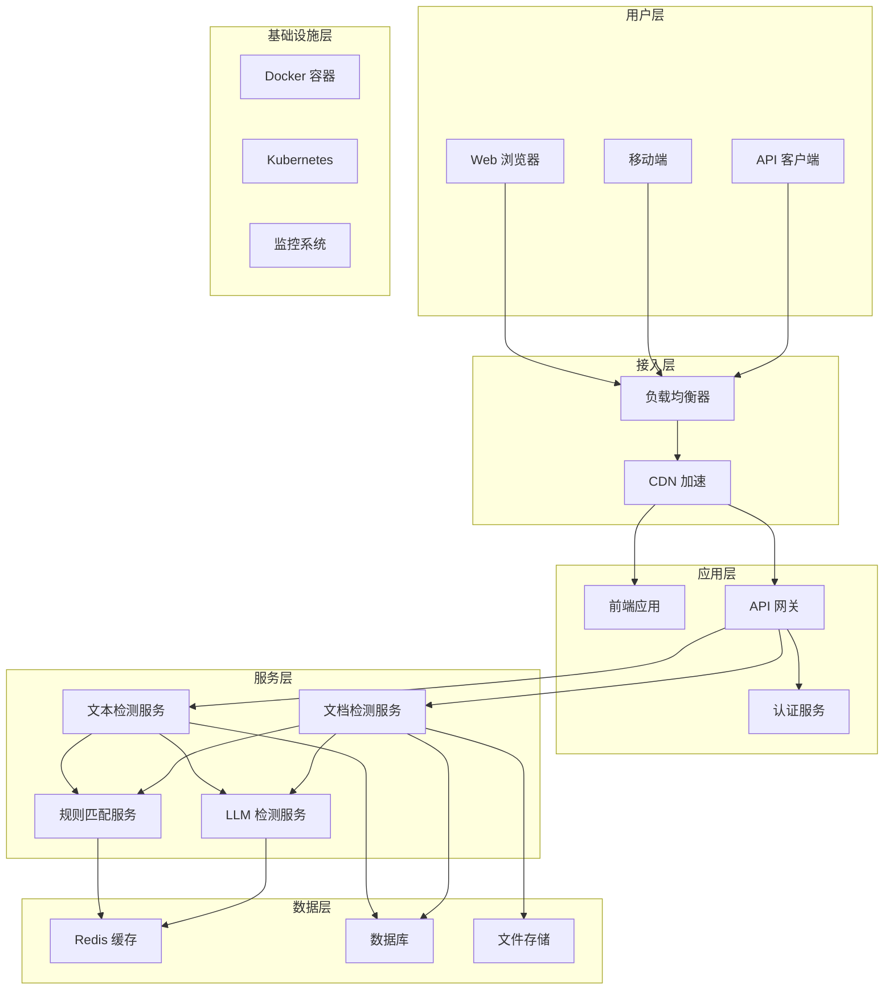
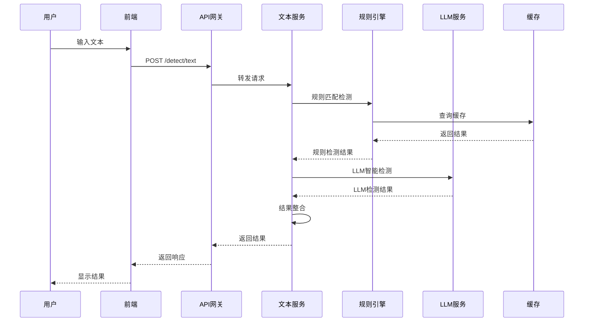
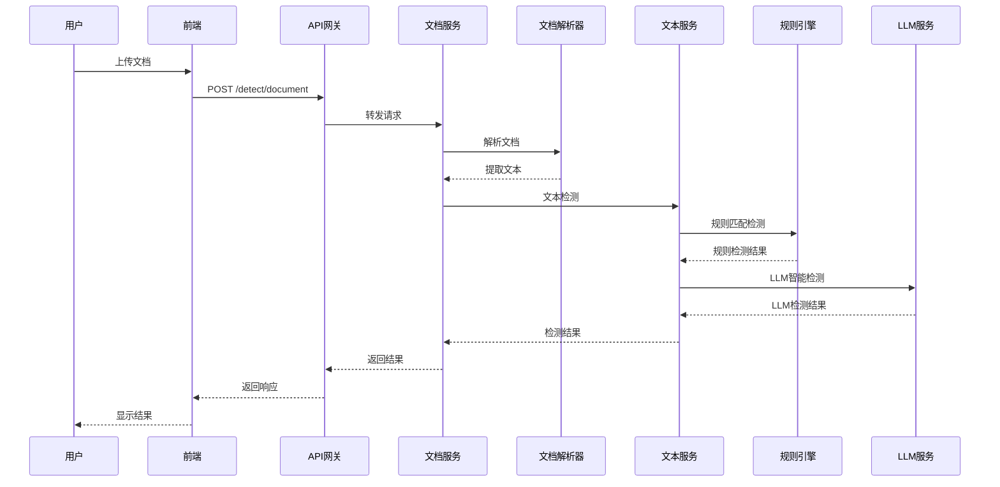

# 系统架构设计文档

## 概述

敏感词检测系统采用现代化的微服务架构，结合传统算法和人工智能技术，为用户提供高效、准确的内容安全检测服务。系统设计遵循高可用、高性能、可扩展的原则。

## 整体架构

### 架构图



### 技术栈

| 层级 | 技术选型 | 说明 |
|------|----------|------|
| 前端 | HTML5/CSS3/JavaScript | 原生技术栈 |
| 后端 | FastAPI/Python 3.10 | 现代化 Web 框架 |
| AI 服务 | Ollama/Qwen:7b | 本地 LLM 部署 |
| 容器化 | Docker/Docker Compose | 容器编排 |
| 反向代理 | Nginx | 负载均衡和 SSL |
| 监控 | Prometheus/Grafana | 系统监控 |
| 日志 | ELK Stack | 日志分析 |

## 核心组件

### 1. 前端应用

**架构特点**:
- 单页应用 (SPA)
- 响应式设计
- 组件化开发
- 现代化 UI/UX

**技术实现**:
```javascript
// 模块化架构
const App = {
    // 配置模块
    config: {
        API_BASE_URL: 'http://localhost:8000',
        TIMEOUT: 30000
    },
    
    // 服务模块
    services: {
        textDetection: new TextDetectionService(),
        documentDetection: new DocumentDetectionService()
    },
    
    // 组件模块
    components: {
        textPanel: new TextPanel(),
        documentPanel: new DocumentPanel(),
        notification: new Notification()
    },
    
    // 工具模块
    utils: {
        formatFileSize: (bytes) => { /* ... */ },
        showNotification: (message, type) => { /* ... */ }
    }
};
```

**设计模式**:
- 观察者模式: 事件监听和通知
- 策略模式: 不同检测策略
- 工厂模式: 组件创建
- 单例模式: 全局配置

### 2. 后端 API 服务

**架构特点**:
- RESTful API 设计
- 异步处理
- 中间件支持
- 自动文档生成

**技术实现**:
```python
# 分层架构
class Application:
    def __init__(self):
        self.app = FastAPI()
        self.setup_middleware()
        self.setup_routes()
        self.setup_services()
    
    def setup_middleware(self):
        # CORS 中间件
        self.app.add_middleware(CORSMiddleware, ...)
        
        # 请求限流中间件
        self.app.add_middleware(RateLimitMiddleware, ...)
        
        # 日志中间件
        self.app.add_middleware(LoggingMiddleware, ...)
    
    def setup_routes(self):
        # API 路由
        self.app.include_router(text_router, prefix="/api/v1")
        self.app.include_router(document_router, prefix="/api/v1")
        self.app.include_router(health_router, prefix="/api/v1")
    
    def setup_services(self):
        # 服务依赖注入
        self.text_service = TextDetectionService()
        self.document_service = DocumentDetectionService()
        self.llm_service = LLMDetectionService()
```

**设计模式**:
- 依赖注入: 服务解耦
- 工厂模式: 服务创建
- 策略模式: 检测算法
- 装饰器模式: 中间件和路由

### 3. 检测算法服务

**规则匹配算法**:
```python
class TrieNode:
    def __init__(self):
        self.children = {}
        self.is_end = False
        self.word = ""

class SensitiveWordDetector:
    def __init__(self, words_file: str):
        self.root = TrieNode()
        self.load_words(words_file)
    
    def detect(self, text: str) -> List[str]:
        """Trie 树敏感词检测"""
        sensitive_words = []
        text_lower = text.lower()
        
        for i in range(len(text_lower)):
            node = self.root
            j = i
            while j < len(text_lower) and text_lower[j] in node.children:
                node = node.children[text_lower[j]]
                if node.is_end:
                    sensitive_words.append(node.word)
                j += 1
        
        return list(set(sensitive_words))
```

**LLM 检测算法**:
```python
class LLMDetectionService:
    def __init__(self, base_url: str, model: str):
        self.base_url = base_url
        self.model = model
        self.session = requests.Session()
    
    async def detect(self, text: str) -> str:
        """LLM 智能检测"""
        prompt = self.build_prompt(text)
        
        try:
            response = await self.session.post(
                f"{self.base_url}/api/generate",
                json={
                    "model": self.model,
                    "prompt": prompt,
                    "stream": False,
                    "temperature": 0
                },
                timeout=30
            )
            
            if response.status_code == 200:
                result = response.json()
                return self.parse_response(result.get("response", ""))
            else:
                return "正常"
                
        except Exception as e:
            logger.error(f"LLM 检测失败: {e}")
            return "正常"
    
    def build_prompt(self, text: str) -> str:
        """构建检测提示词"""
        return f"""
        你是专业的内容安全检测系统。请严格按照以下规则进行判断：

        【敏感内容标准】
        必须同时满足以下条件才判定为敏感：
        1. 包含明确的辱骂词汇
        2. 包含暴力威胁
        3. 包含违法内容
        4. 包含色情内容
        5. 包含歧视内容

        【检测文本】
        {text[:500]}

        【判断规则】
        - 如果文本明显包含上述任何一类敏感内容，回答：敏感
        - 如果文本是正常的日常对话、描述、询问等，回答：正常
        - 对于模糊边界的内容，倾向于判定为正常

        【输出要求】
        请严格按照以下格式输出，不要添加任何其他内容：
        敏感
        或
        正常
        """
```

### 4. 文档处理服务

**文档解析架构**:
```python
class DocumentProcessor:
    def __init__(self):
        self.parsers = {
            'text/plain': self.parse_text,
            'application/pdf': self.parse_pdf,
            'application/vnd.openxmlformats-officedocument.wordprocessingml.document': self.parse_docx
        }
    
    def process(self, file: UploadFile) -> str:
        """文档处理入口"""
        content_type = file.content_type
        
        if content_type not in self.parsers:
            raise UnsupportedFileTypeError(f"不支持的文件类型: {content_type}")
        
        return self.parsers[content_type](file)
    
    def parse_text(self, file: UploadFile) -> str:
        """解析纯文本文件"""
        content = file.file.read()
        return content.decode("utf-8")
    
    def parse_pdf(self, file: UploadFile) -> str:
        """解析 PDF 文件"""
        content = file.file.read()
        pdf_reader = PyPDF2.PdfReader(io.BytesIO(content))
        
        text = ""
        for page in pdf_reader.pages:
            text += page.extract_text()
        
        return text
    
    def parse_docx(self, file: UploadFile) -> str:
        """解析 DOCX 文件"""
        content = file.file.read()
        doc = Document(io.BytesIO(content))
        
        text = ""
        for paragraph in doc.paragraphs:
            text += paragraph.text + "\n"
        
        return text
```

## 数据流设计

### 1. 文本检测流程



### 2. 文档检测流程



## 性能设计

### 1. 缓存策略

**多级缓存架构**:
```python
class CacheManager:
    def __init__(self):
        self.redis_client = redis.Redis(host='localhost', port=6379, db=0)
        self.local_cache = {}
        self.cache_ttl = 3600  # 1小时
    
    async def get(self, key: str) -> Optional[str]:
        # L1: 本地缓存
        if key in self.local_cache:
            return self.local_cache[key]
        
        # L2: Redis 缓存
        value = self.redis_client.get(key)
        if value:
            self.local_cache[key] = value
            return value.decode('utf-8')
        
        return None
    
    async def set(self, key: str, value: str, ttl: int = None):
        ttl = ttl or self.cache_ttl
        
        # 设置本地缓存
        self.local_cache[key] = value
        
        # 设置 Redis 缓存
        self.redis_client.setex(key, ttl, value)
    
    async def delete(self, key: str):
        # 删除本地缓存
        if key in self.local_cache:
            del self.local_cache[key]
        
        # 删除 Redis 缓存
        self.redis_client.delete(key)
```

**缓存策略**:
- **热点数据**: 本地缓存 + Redis
- **温数据**: Redis 缓存
- **冷数据**: 数据库存储
- **缓存更新**: 写时更新 + 定时刷新

### 2. 并发处理

**异步处理架构**:
```python
import asyncio
from concurrent.futures import ThreadPoolExecutor

class AsyncProcessor:
    def __init__(self, max_workers: int = 4):
        self.executor = ThreadPoolExecutor(max_workers=max_workers)
        self.semaphore = asyncio.Semaphore(100)  # 限制并发数
    
    async def process_batch(self, tasks: List[Task]) -> List[Result]:
        """批量异步处理"""
        async with self.semaphore:
            futures = [self.process_single(task) for task in tasks]
            results = await asyncio.gather(*futures, return_exceptions=True)
            return results
    
    async def process_single(self, task: Task) -> Result:
        """单个任务处理"""
        loop = asyncio.get_event_loop()
        return await loop.run_in_executor(
            self.executor, 
            self.sync_process, 
            task
        )
    
    def sync_process(self, task: Task) -> Result:
        """同步处理逻辑"""
        # 实际的检测逻辑
        pass
```

**连接池管理**:
```python
import aiohttp
from aiohttp import ClientSession, TCPConnector

class ConnectionPool:
    def __init__(self, max_connections: int = 100):
        self.connector = TCPConnector(
            limit=max_connections,
            limit_per_host=30,
            ttl_dns_cache=300,
            use_dns_cache=True
        )
        self.session = None
    
    async def get_session(self) -> ClientSession:
        if self.session is None or self.session.closed:
            self.session = ClientSession(connector=self.connector)
        return self.session
    
    async def close(self):
        if self.session and not self.session.closed:
            await self.session.close()
```

### 3. 负载均衡

**Nginx 配置**:
```nginx
upstream backend {
    least_conn;  # 最少连接算法
    server 127.0.0.1:8001 weight=3;
    server 127.0.0.1:8002 weight=3;
    server 127.0.0.1:8003 weight=2;
    
    keepalive 32;
}

server {
    listen 80;
    server_name api.example.com;
    
    location / {
        proxy_pass http://backend;
        proxy_set_header Host $host;
        proxy_set_header X-Real-IP $remote_addr;
        proxy_set_header X-Forwarded-For $proxy_add_x_forwarded_for;
        
        # 连接保持
        proxy_http_version 1.1;
        proxy_set_header Connection "";
        
        # 超时配置
        proxy_connect_timeout 5s;
        proxy_send_timeout 30s;
        proxy_read_timeout 30s;
        
        # 缓冲配置
        proxy_buffering on;
        proxy_buffer_size 4k;
        proxy_buffers 8 4k;
    }
}
```

## 安全架构

### 1. 认证授权

**JWT 认证**:
```python
from jose import JWTError, jwt
from datetime import datetime, timedelta

class AuthService:
    def __init__(self, secret_key: str, algorithm: str = "HS256"):
        self.secret_key = secret_key
        self.algorithm = algorithm
        self.access_token_expire_minutes = 30
    
    def create_access_token(self, data: dict) -> str:
        """创建访问令牌"""
        to_encode = data.copy()
        expire = datetime.utcnow() + timedelta(minutes=self.access_token_expire_minutes)
        to_encode.update({"exp": expire})
        
        encoded_jwt = jwt.encode(to_encode, self.secret_key, algorithm=self.algorithm)
        return encoded_jwt
    
    def verify_token(self, token: str) -> dict:
        """验证令牌"""
        try:
            payload = jwt.decode(token, self.secret_key, algorithms=[self.algorithm])
            return payload
        except JWTError:
            raise HTTPException(status_code=401, detail="无效的令牌")
```

**权限控制**:
```python
from functools import wraps

def require_auth(f):
    @wraps(f)
    async def decorated_function(*args, **kwargs):
        token = request.headers.get('Authorization')
        if not token:
            raise HTTPException(status_code=401, detail="缺少认证令牌")
        
        try:
            payload = auth_service.verify_token(token)
            request.current_user = payload
        except HTTPException:
            raise
        
        return await f(*args, **kwargs)
    return decorated_function

def require_permission(permission: str):
    def decorator(f):
        @wraps(f)
        async def decorated_function(*args, **kwargs):
            user = request.current_user
            if permission not in user.get('permissions', []):
                raise HTTPException(status_code=403, detail="权限不足")
            return await f(*args, **kwargs)
        return decorated_function
    return decorator
```

### 2. 数据安全

**输入验证**:
```python
from pydantic import BaseModel, validator, Field

class TextDetectionRequest(BaseModel):
    text: str = Field(..., min_length=1, max_length=10000)
    
    @validator('text')
    def validate_text(cls, v):
        # 检查是否包含恶意内容
        if '<script>' in v.lower():
            raise ValueError('文本包含恶意脚本')
        return v.strip()

class DocumentDetectionRequest(BaseModel):
    file: UploadFile
    
    @validator('file')
    def validate_file(cls, v):
        # 检查文件类型
        allowed_types = [
            'text/plain',
            'application/pdf',
            'application/vnd.openxmlformats-officedocument.wordprocessingml.document'
        ]
        if v.content_type not in allowed_types:
            raise ValueError('不支持的文件类型')
        
        # 检查文件大小
        if v.size > 10 * 1024 * 1024:  # 10MB
            raise ValueError('文件大小超过限制')
        
        return v
```

**数据加密**:
```python
from cryptography.fernet import Fernet
import base64

class DataEncryption:
    def __init__(self, key: bytes):
        self.cipher = Fernet(key)
    
    def encrypt(self, data: str) -> str:
        """加密数据"""
        encrypted_data = self.cipher.encrypt(data.encode())
        return base64.b64encode(encrypted_data).decode()
    
    def decrypt(self, encrypted_data: str) -> str:
        """解密数据"""
        decoded_data = base64.b64decode(encrypted_data.encode())
        decrypted_data = self.cipher.decrypt(decoded_data)
        return decrypted_data.decode()
```

### 3. 网络安全

**HTTPS 配置**:
```nginx
server {
    listen 443 ssl http2;
    server_name api.example.com;
    
    # SSL 证书配置
    ssl_certificate /etc/ssl/certs/api.example.com.crt;
    ssl_certificate_key /etc/ssl/private/api.example.com.key;
    
    # SSL 安全配置
    ssl_protocols TLSv1.2 TLSv1.3;
    ssl_ciphers ECDHE-RSA-AES256-GCM-SHA512:DHE-RSA-AES256-GCM-SHA512;
    ssl_prefer_server_ciphers off;
    ssl_session_cache shared:SSL:10m;
    ssl_session_timeout 10m;
    
    # 安全头
    add_header Strict-Transport-Security "max-age=31536000; includeSubDomains" always;
    add_header X-Frame-Options DENY;
    add_header X-Content-Type-Options nosniff;
    add_header X-XSS-Protection "1; mode=block";
    add_header Referrer-Policy "strict-origin-when-cross-origin";
    
    location / {
        proxy_pass http://backend;
        # ... 其他配置
    }
}
```

**防火墙配置**:
```bash
# UFW 防火墙配置
sudo ufw default deny incoming
sudo ufw default allow outgoing
sudo ufw allow ssh
sudo ufw allow 80/tcp
sudo ufw allow 443/tcp
sudo ufw enable

# iptables 配置
sudo iptables -A INPUT -p tcp --dport 22 -j ACCEPT
sudo iptables -A INPUT -p tcp --dport 80 -j ACCEPT
sudo iptables -A INPUT -p tcp --dport 443 -j ACCEPT
sudo iptables -A INPUT -m state --state ESTABLISHED,RELATED -j ACCEPT
sudo iptables -A INPUT -j DROP
```

## 监控架构

### 1. 系统监控

**Prometheus 配置**:
```yaml
# prometheus.yml
global:
  scrape_interval: 15s
  evaluation_interval: 15s

scrape_configs:
  - job_name: 'sensitive-detector'
    static_configs:
      - targets: ['localhost:8000']
    metrics_path: '/metrics'
    scrape_interval: 30s

  - job_name: 'node-exporter'
    static_configs:
      - targets: ['localhost:9100']

  - job_name: 'docker'
    static_configs:
      - targets: ['localhost:9323']
```

**Grafana 仪表板**:
```json
{
  "dashboard": {
    "title": "敏感词检测系统监控",
    "panels": [
      {
        "title": "API 请求率",
        "type": "graph",
        "targets": [
          {
            "expr": "rate(http_requests_total[5m])",
            "legendFormat": "{{method}} {{endpoint}}"
          }
        ]
      },
      {
        "title": "响应时间",
        "type": "graph",
        "targets": [
          {
            "expr": "histogram_quantile(0.95, rate(http_request_duration_seconds_bucket[5m]))",
            "legendFormat": "95th percentile"
          }
        ]
      },
      {
        "title": "错误率",
        "type": "graph",
        "targets": [
          {
            "expr": "rate(http_requests_total{status=~\"5..\"}[5m])",
            "legendFormat": "5xx errors"
          }
        ]
      }
    ]
  }
}
```

### 2. 日志监控

**ELK Stack 配置**:
```yaml
# docker-compose.logging.yml
version: '3.8'

services:
  elasticsearch:
    image: docker.elastic.co/elasticsearch/elasticsearch:8.8.0
    environment:
      - discovery.type=single-node
      - xpack.security.enabled=false
    ports:
      - "9200:9200"
    volumes:
      - elasticsearch_data:/usr/share/elasticsearch/data

  logstash:
    image: docker.elastic.co/logstash/logstash:8.8.0
    ports:
      - "5044:5044"
    volumes:
      - ./logstash.conf:/usr/share/logstash/pipeline/logstash.conf
    depends_on:
      - elasticsearch

  kibana:
    image: docker.elastic.co/kibana/kibana:8.8.0
    ports:
      - "5601:5601"
    environment:
      - ELASTICSEARCH_HOSTS=http://elasticsearch:9200
    depends_on:
      - elasticsearch

volumes:
  elasticsearch_data:
```

**Logstash 配置**:
```ruby
# logstash.conf
input {
  beats {
    port => 5044
  }
}

filter {
  if [fields][service] == "sensitive-detector" {
    grok {
      match => { "message" => "%{TIMESTAMP_ISO8601:timestamp} %{LOGLEVEL:level} %{GREEDYDATA:message}" }
    }
    
    date {
      match => [ "timestamp", "ISO8601" ]
    }
    
    mutate {
      add_field => { "service" => "sensitive-detector" }
    }
  }
}

output {
  elasticsearch {
    hosts => ["elasticsearch:9200"]
    index => "sensitive-detector-%{+YYYY.MM.dd}"
  }
}
```

### 3. 告警系统

**Alertmanager 配置**:
```yaml
# alertmanager.yml
global:
  smtp_smarthost: 'localhost:587'
  smtp_from: 'alerts@example.com'

route:
  group_by: ['alertname']
  group_wait: 10s
  group_interval: 10s
  repeat_interval: 1h
  receiver: 'web.hook'

receivers:
  - name: 'web.hook'
    webhook_configs:
      - url: 'http://localhost:5001/'

  - name: 'email'
    email_configs:
      - to: 'admin@example.com'
        subject: '敏感词检测系统告警'
        body: |
          告警名称: {{ .GroupLabels.alertname }}
          告警级别: {{ .GroupLabels.severity }}
          告警时间: {{ .GroupLabels.timestamp }}
          告警详情: {{ .GroupLabels.description }}
```

**告警规则**:
```yaml
# alerts.yml
groups:
  - name: sensitive-detector
    rules:
      - alert: HighErrorRate
        expr: rate(http_requests_total{status=~"5.."}[5m]) > 0.1
        for: 5m
        labels:
          severity: critical
        annotations:
          summary: "错误率过高"
          description: "API 错误率超过 10%"

      - alert: HighResponseTime
        expr: histogram_quantile(0.95, rate(http_request_duration_seconds_bucket[5m])) > 2
        for: 5m
        labels:
          severity: warning
        annotations:
          summary: "响应时间过长"
          description: "95% 响应时间超过 2 秒"

      - alert: ServiceDown
        expr: up == 0
        for: 1m
        labels:
          severity: critical
        annotations:
          summary: "服务不可用"
          description: "敏感词检测服务不可用"
```

## 扩展性设计

### 1. 水平扩展

**微服务拆分**:
```python
# 服务注册与发现
class ServiceRegistry:
    def __init__(self, consul_host: str, consul_port: int):
        self.consul = consul.Consul(host=consul_host, port=consul_port)
    
    def register_service(self, service_name: str, service_id: str, 
                        address: str, port: int, health_check: str):
        """注册服务"""
        self.consul.agent.service.register(
            name=service_name,
            service_id=service_id,
            address=address,
            port=port,
            check=consul.Check.http(health_check, interval="10s")
        )
    
    def discover_service(self, service_name: str) -> List[Service]:
        """发现服务"""
        services = self.consul.health.service(service_name, passing=True)[1]
        return [Service(s['Service']['Address'], s['Service']['Port']) 
                for s in services]
```

**负载均衡**:
```python
class LoadBalancer:
    def __init__(self, strategy: str = "round_robin"):
        self.strategy = strategy
        self.services = []
        self.current_index = 0
    
    def add_service(self, service: Service):
        """添加服务"""
        self.services.append(service)
    
    def get_service(self) -> Service:
        """获取服务"""
        if not self.services:
            raise NoServiceAvailableError("没有可用的服务")
        
        if self.strategy == "round_robin":
            service = self.services[self.current_index]
            self.current_index = (self.current_index + 1) % len(self.services)
            return service
        elif self.strategy == "random":
            return random.choice(self.services)
        elif self.strategy == "least_connections":
            return min(self.services, key=lambda s: s.connection_count)
```

### 2. 垂直扩展

**资源监控**:
```python
import psutil
import threading
import time

class ResourceMonitor:
    def __init__(self, threshold: float = 0.8):
        self.threshold = threshold
        self.monitoring = False
        self.monitor_thread = None
    
    def start_monitoring(self):
        """开始监控"""
        self.monitoring = True
        self.monitor_thread = threading.Thread(target=self._monitor_loop)
        self.monitor_thread.start()
    
    def stop_monitoring(self):
        """停止监控"""
        self.monitoring = False
        if self.monitor_thread:
            self.monitor_thread.join()
    
    def _monitor_loop(self):
        """监控循环"""
        while self.monitoring:
            cpu_percent = psutil.cpu_percent(interval=1)
            memory_percent = psutil.virtual_memory().percent
            
            if cpu_percent > self.threshold * 100:
                self._handle_high_cpu(cpu_percent)
            
            if memory_percent > self.threshold * 100:
                self._handle_high_memory(memory_percent)
            
            time.sleep(10)
    
    def _handle_high_cpu(self, cpu_percent: float):
        """处理高 CPU 使用率"""
        logger.warning(f"CPU 使用率过高: {cpu_percent}%")
        # 触发扩容或优化
    
    def _handle_high_memory(self, memory_percent: float):
        """处理高内存使用率"""
        logger.warning(f"内存使用率过高: {memory_percent}%")
        # 触发扩容或垃圾回收
```

### 3. 数据库扩展

**读写分离**:
```python
class DatabaseManager:
    def __init__(self):
        self.write_db = create_engine("postgresql://write_db_url")
        self.read_db = create_engine("postgresql://read_db_url")
        self.read_replicas = [
            create_engine("postgresql://read_replica1_url"),
            create_engine("postgresql://read_replica2_url")
        ]
    
    def get_write_connection(self):
        """获取写连接"""
        return self.write_db
    
    def get_read_connection(self):
        """获取读连接"""
        # 轮询选择读副本
        replica = self.read_replicas[self.current_replica]
        self.current_replica = (self.current_replica + 1) % len(self.read_replicas)
        return replica
```

**分库分表**:
```python
class ShardingManager:
    def __init__(self, shard_count: int = 4):
        self.shard_count = shard_count
        self.shards = [
            create_engine(f"postgresql://shard_{i}_url") 
            for i in range(shard_count)
        ]
    
    def get_shard(self, key: str) -> Engine:
        """根据键获取分片"""
        shard_index = hash(key) % self.shard_count
        return self.shards[shard_index]
    
    def execute_on_all_shards(self, query: str, params: dict):
        """在所有分片上执行查询"""
        results = []
        for shard in self.shards:
            result = shard.execute(query, params)
            results.append(result)
        return results
```

## 容错设计

### 1. 故障隔离

**熔断器模式**:
```python
import time
from enum import Enum

class CircuitState(Enum):
    CLOSED = "closed"
    OPEN = "open"
    HALF_OPEN = "half_open"

class CircuitBreaker:
    def __init__(self, failure_threshold: int = 5, timeout: int = 60):
        self.failure_threshold = failure_threshold
        self.timeout = timeout
        self.failure_count = 0
        self.last_failure_time = None
        self.state = CircuitState.CLOSED
    
    def call(self, func, *args, **kwargs):
        """调用受保护的方法"""
        if self.state == CircuitState.OPEN:
            if time.time() - self.last_failure_time > self.timeout:
                self.state = CircuitState.HALF_OPEN
            else:
                raise CircuitBreakerOpenError("熔断器开启")
        
        try:
            result = func(*args, **kwargs)
            self._on_success()
            return result
        except Exception as e:
            self._on_failure()
            raise e
    
    def _on_success(self):
        """成功时重置"""
        self.failure_count = 0
        self.state = CircuitState.CLOSED
    
    def _on_failure(self):
        """失败时计数"""
        self.failure_count += 1
        self.last_failure_time = time.time()
        
        if self.failure_count >= self.failure_threshold:
            self.state = CircuitState.OPEN
```

**重试机制**:
```python
import asyncio
from functools import wraps

def retry(max_attempts: int = 3, delay: float = 1.0, backoff: float = 2.0):
    def decorator(func):
        @wraps(func)
        async def wrapper(*args, **kwargs):
            last_exception = None
            
            for attempt in range(max_attempts):
                try:
                    return await func(*args, **kwargs)
                except Exception as e:
                    last_exception = e
                    
                    if attempt == max_attempts - 1:
                        break
                    
                    wait_time = delay * (backoff ** attempt)
                    await asyncio.sleep(wait_time)
            
            raise last_exception
        return wrapper
    return decorator

# 使用示例
@retry(max_attempts=3, delay=1.0, backoff=2.0)
async def call_ollama_api(text: str) -> str:
    # API 调用逻辑
    pass
```

### 2. 降级策略

**服务降级**:
```python
class ServiceDegradation:
    def __init__(self):
        self.degradation_level = 0  # 0: 正常, 1: 轻度降级, 2: 重度降级
    
    def detect_text(self, text: str) -> dict:
        """文本检测（支持降级）"""
        if self.degradation_level == 0:
            # 正常模式：规则 + LLM
            rule_result = self.rule_detection(text)
            llm_result = self.llm_detection(text)
            return self.combine_results(rule_result, llm_result)
        
        elif self.degradation_level == 1:
            # 轻度降级：仅规则检测
            rule_result = self.rule_detection(text)
            return {"rule_detected": rule_result, "llm_detected": "正常", "final_result": rule_result}
        
        else:
            # 重度降级：返回默认结果
            return {"rule_detected": "正常", "llm_detected": "正常", "final_result": "正常"}
    
    def update_degradation_level(self, level: int):
        """更新降级级别"""
        self.degradation_level = level
        logger.info(f"服务降级级别更新为: {level}")
```

### 3. 数据备份

**自动备份**:
```python
import shutil
import schedule
import time
from datetime import datetime

class BackupManager:
    def __init__(self, backup_dir: str = "/opt/backups"):
        self.backup_dir = backup_dir
        self.schedule_backup()
    
    def schedule_backup(self):
        """调度备份任务"""
        schedule.every().day.at("02:00").do(self.full_backup)
        schedule.every().hour.do(self.incremental_backup)
    
    def full_backup(self):
        """全量备份"""
        timestamp = datetime.now().strftime("%Y%m%d_%H%M%S")
        backup_path = f"{self.backup_dir}/full_backup_{timestamp}"
        
        try:
            shutil.copytree("/opt/sensitive-detector", backup_path)
            logger.info(f"全量备份完成: {backup_path}")
        except Exception as e:
            logger.error(f"全量备份失败: {e}")
    
    def incremental_backup(self):
        """增量备份"""
        timestamp = datetime.now().strftime("%Y%m%d_%H%M%S")
        backup_path = f"{self.backup_dir}/incremental_backup_{timestamp}"
        
        try:
            # 只备份变更的文件
            self.backup_changed_files(backup_path)
            logger.info(f"增量备份完成: {backup_path}")
        except Exception as e:
            logger.error(f"增量备份失败: {e}")
    
    def run_scheduler(self):
        """运行调度器"""
        while True:
            schedule.run_pending()
            time.sleep(60)
```

## 总结

敏感词检测系统采用现代化的微服务架构，具备以下特点：

1. **高可用性**: 通过负载均衡、故障转移、自动恢复等机制确保服务稳定运行
2. **高性能**: 采用异步处理、缓存优化、连接池等技术提升系统性能
3. **可扩展性**: 支持水平扩展和垂直扩展，适应业务增长需求
4. **安全性**: 多层次安全防护，包括认证授权、数据加密、网络安全等
5. **可观测性**: 完善的监控、日志、告警体系，便于运维管理
6. **容错性**: 熔断器、重试机制、降级策略等确保系统在异常情况下的稳定性

该架构设计为系统提供了坚实的技术基础，能够满足当前业务需求并支持未来发展。

---

**文档版本**: v1.0.0  
**最后更新**: 2025年10月
