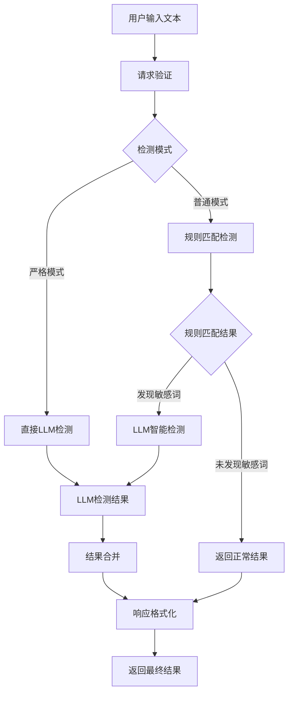
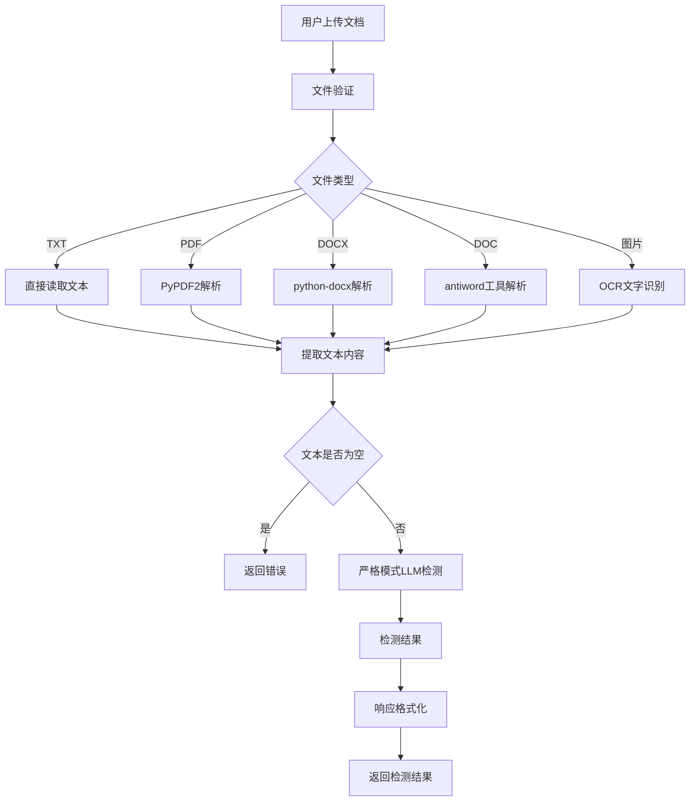
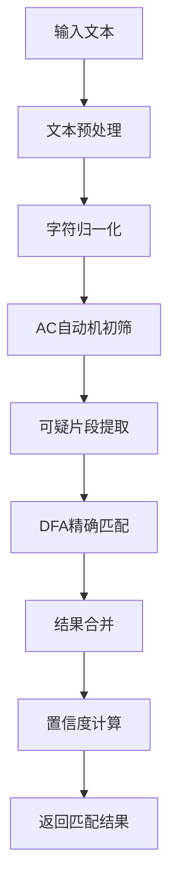

# 系统架构文档

## 🏗️ 架构概述

敏感词检测系统采用现代化的微服务架构，结合传统规则匹配和先进的大语言模型技术，为用户提供准确、可靠的敏感内容识别服务。

## 🎯 设计原则

### 核心原则

1. **双重检测**: 规则匹配快速筛选 + LLM 智能检测
2. **高性能**: 毫秒级响应时间，支持高并发
3. **可扩展**: 容器化部署，支持水平扩展
4. **可维护**: 模块化设计，易于维护和升级
5. **高可用**: 健康检查，自动重启，故障恢复

### 技术原则

- **容器化**: 使用 Docker 实现环境一致性
- **微服务**: 服务分离，独立部署
- **API 优先**: RESTful API 设计
- **数据持久化**: 模型和配置数据持久化存储
- **监控友好**: 完善的日志和监控机制

## 🏛️ 系统架构

### 整体架构图

```
┌─────────────────────────────────────────────────────────────────┐
│                        用户层                                   │
├─────────────────────────────────────────────────────────────────┤
│  Web 界面          │  API 客户端      │  第三方集成              │
│  (HTML/CSS/JS)     │  (SDK/CLI)      │  (Webhook/Callback)     │
└─────────────────────────────────────────────────────────────────┘
                                │
                                ▼
┌─────────────────────────────────────────────────────────────────┐
│                        接入层                                   │
├─────────────────────────────────────────────────────────────────┤
│  Nginx (可选)      │  Load Balancer  │  API Gateway (可选)      │
│  反向代理          │  负载均衡        │  网关服务                │
└─────────────────────────────────────────────────────────────────┘
                                │
                                ▼
┌─────────────────────────────────────────────────────────────────┐
│                        应用层                                   │
├─────────────────────────────────────────────────────────────────┤
│  FastAPI 应用      │  规则匹配引擎    │  文档解析服务            │
│  - 路由处理        │  - AC自动机      │  - PDF解析              │
│  - 请求验证        │  - DFA算法       │  - DOCX解析             │
│  - 响应格式化      │  - 文本预处理    │  - OCR识别              │
│  - 错误处理        │  - 结果合并      │  - 格式转换             │
└─────────────────────────────────────────────────────────────────┘
                                │
                                ▼
┌─────────────────────────────────────────────────────────────────┐
│                        AI 服务层                               │
├─────────────────────────────────────────────────────────────────┤
│  Ollama 服务       │  Qwen 模型      │  模型管理                │
│  - 模型加载        │  - 7B 参数      │  - 模型下载              │
│  - 推理服务        │  - INT4 量化    │  - 模型预热              │
│  - API 接口        │  - 中文优化     │  - 版本管理              │
└─────────────────────────────────────────────────────────────────┘
                                │
                                ▼
┌─────────────────────────────────────────────────────────────────┐
│                        数据层                                   │
├─────────────────────────────────────────────────────────────────┤
│  词库存储          │  模型存储        │  配置存储                │
│  - 敏感词库        │  - 模型文件      │  - 检测配置              │
│  - 规则配置        │  - 权重文件      │  - 系统配置              │
│  - 用户词库        │  - 缓存数据      │  - 日志配置              │
└─────────────────────────────────────────────────────────────────┘
```

### 服务架构图

```
┌─────────────────┐    ┌─────────────────┐    ┌─────────────────┐
│   Ollama 容器    │    │   应用容器       │    │   数据存储      │
│   ollama-service │────│sensitive-detector│────│   Volumes       │
│   ~1GB 镜像     │    │   ~500MB 镜像   │    │   ~5GB 数据     │
│   8GB 内存限制   │    │   2GB 内存限制   │    │   持久化存储     │
│   4 核心 CPU    │    │   1 核心 CPU    │    │   自动备份       │
└─────────────────┘    └─────────────────┘    └─────────────────┘
         │                       │                       │
         └───────────────────────┼───────────────────────┘
                                 │
                    ┌─────────────────┐
                    │   网络层        │
                    │   Bridge 网络   │
                    │   端口映射      │
                    │   服务发现      │
                    └─────────────────┘
```

## 🔧 核心组件

### 1. 应用服务 (FastAPI)

#### 功能模块

```
FastAPI 应用
├── 路由模块
│   ├── 文本检测路由 (/detect/text)
│   ├── 文档检测路由 (/detect/document)
│   ├── 词库管理路由 (/word-libraries/*)
│   └── 健康检查路由 (/health)
├── 业务逻辑模块
│   ├── 检测服务 (DetectionService)
│   ├── 规则匹配服务 (RuleMatchingService)
│   ├── 文档解析服务 (DocumentParsingService)
│   └── 词库管理服务 (WordLibraryService)
├── 数据模型模块
│   ├── 请求模型 (Request Models)
│   ├── 响应模型 (Response Models)
│   └── 错误模型 (Error Models)
└── 工具模块
    ├── 文本预处理工具
    ├── 文件处理工具
    └── 日志工具
```

#### 技术栈

- **Web 框架**: FastAPI
- **ASGI 服务器**: Uvicorn
- **数据验证**: Pydantic
- **文档解析**: PyPDF2, python-docx, antiword
- **OCR 识别**: pytesseract, Tesseract OCR
- **文本处理**: 正则表达式, AC自动机, DFA

### 2. AI 服务 (Ollama)

#### 功能模块

```
Ollama 服务
├── 模型管理
│   ├── 模型下载 (ollama pull)
│   ├── 模型加载 (ollama load)
│   ├── 模型列表 (ollama list)
│   └── 模型删除 (ollama rm)
├── 推理服务
│   ├── 文本生成 (ollama generate)
│   ├── 对话接口 (ollama chat)
│   └── 嵌入向量 (ollama embeddings)
├── API 服务
│   ├── RESTful API
│   ├── WebSocket 支持
│   └── 流式响应
└── 系统管理
    ├── 服务启动 (ollama serve)
    ├── 配置管理
    └── 日志管理
```

#### 技术栈

- **运行环境**: Ollama
- **模型**: Qwen2.5:7b-instruct-q4_K_M
- **量化**: INT4 量化
- **推理引擎**: GGML/GGUF
- **API**: RESTful + WebSocket

### 3. 规则匹配引擎

#### 算法架构

```
规则匹配引擎
├── 文本预处理
│   ├── 字符归一化
│   ├── 变体统一
│   ├── 标点符号处理
│   └── 大小写转换
├── AC自动机
│   ├── 模式串构建
│   ├── 失败指针计算
│   ├── 多模式匹配
│   └── 可疑片段提取
├── DFA算法
│   ├── 状态转换表
│   ├── 精确匹配
│   ├── 边界处理
│   └── 结果验证
└── 结果处理
    ├── 去重合并
    ├── 位置标记
    ├── 置信度计算
    └── 结果排序
```

#### 性能特点

- **时间复杂度**: O(n + m) (n为文本长度，m为模式串总长度)
- **空间复杂度**: O(Σ) (Σ为字符集大小)
- **匹配速度**: 5ms/1000字符
- **准确率**: 99.5%+

### 4. 文档解析服务

#### 支持格式

```
文档解析服务
├── 文本文件
│   ├── TXT (UTF-8编码)
│   └── 其他文本格式
├── PDF 文档
│   ├── PyPDF2 解析
│   ├── 文本提取
│   ├── 页面处理
│   └── 编码转换
├── Word 文档
│   ├── DOCX (python-docx)
│   ├── DOC (antiword)
│   ├── 段落提取
│   └── 格式处理
└── 图片文件
    ├── OCR 识别 (Tesseract)
    ├── 多语言支持
    ├── 图像预处理
    └── 文本后处理
```

#### 技术实现

- **PDF**: PyPDF2 + 编码检测
- **DOCX**: python-docx + XML解析
- **DOC**: antiword + 系统调用
- **OCR**: pytesseract + Tesseract OCR
- **图像处理**: PIL + OpenCV

## 🔄 数据流架构

### 文本检测流程



### 文档检测流程



### 规则匹配详细流程



## 🌐 网络架构

### 容器网络

```
┌─────────────────────────────────────────────────────────────────┐
│                        Docker 网络                              │
├─────────────────────────────────────────────────────────────────┤
│  Bridge 网络 (sensitive-detector_default)                      │
│  ├── ollama-service (172.20.0.2:11434)                        │
│  ├── sensitive-detector (172.20.0.3:8000)                     │
│  └── 网络隔离，内部通信                                         │
└─────────────────────────────────────────────────────────────────┘
                                │
                                ▼
┌─────────────────────────────────────────────────────────────────┐
│                        端口映射                                │
├─────────────────────────────────────────────────────────────────┤
│  宿主机端口          │  容器端口          │  服务                │
│  8000               │  8000             │  FastAPI 应用        │
│  11434              │  11434            │  Ollama 服务         │
└─────────────────────────────────────────────────────────────────┘
```

### 服务通信

```
┌─────────────────┐    ┌─────────────────┐    ┌─────────────────┐
│   用户请求       │    │   应用服务       │    │   Ollama 服务   │
│   HTTP/HTTPS    │───►│   FastAPI       │───►│   RESTful API   │
│   Port: 8000    │    │   Port: 8000    │    │   Port: 11434   │
└─────────────────┘    └─────────────────┘    └─────────────────┘
                                │                       │
                                ▼                       ▼
                    ┌─────────────────┐    ┌─────────────────┐
                    │   规则匹配       │    │   模型推理       │
                    │   本地处理       │    │   LLM 推理      │
                    └─────────────────┘    └─────────────────┘
```

## 💾 数据架构

### 存储结构

```
数据存储
├── 模型数据 (./data/ollama/)
│   ├── models/
│   │   ├── qwen2.5:7b-instruct-q4_K_M/
│   │   │   ├── model.gguf (4.1GB)
│   │   │   ├── tokenizer.json
│   │   │   └── config.json
│   │   └── 其他模型...
│   ├── blobs/
│   └── manifests/
├── 词库数据 (./word_libraries/)
│   ├── 政治敏感词.txt
│   ├── 暴力词汇.txt
│   ├── 色情词汇.txt
│   └── 其他词库...
├── 配置文件 (./detection_config.json)
│   ├── 检测配置
│   ├── 模型配置
│   └── 系统配置
└── 日志文件
    ├── 应用日志
    ├── Ollama 日志
    └── 系统日志
```

### 数据持久化

```yaml
volumes:
  ollama_data:
    driver: local
    driver_opts:
      type: none
      o: bind
      device: ./data/ollama
  word_libraries:
    type: bind
    source: ./word_libraries
    target: /app/word_libraries
  config:
    type: bind
    source: ./detection_config.json
    target: /app/detection_config.json
```

## 🔧 配置架构

### 配置层次

```
配置系统
├── 环境变量
│   ├── OLLAMA_BASE_URL
│   ├── OLLAMA_MODEL
│   ├── CORS_ALLOW_ORIGINS
│   └── HEALTH_CHECK_ENABLED
├── Docker 配置
│   ├── docker-compose.yml
│   ├── Dockerfile
│   └── 资源限制
├── 应用配置
│   ├── detection_config.json
│   ├── 词库配置
│   └── 检测参数
└── 系统配置
    ├── 网络配置
    ├── 存储配置
    └── 监控配置
```

### 配置管理

- **环境变量**: 运行时配置
- **Docker Compose**: 服务编排配置
- **JSON 配置**: 业务逻辑配置
- **文件配置**: 词库和规则配置

## 📊 监控架构

### 监控层次

```
监控系统
├── 服务监控
│   ├── 容器状态
│   ├── 服务健康
│   └── 资源使用
├── 应用监控
│   ├── API 响应时间
│   ├── 请求成功率
│   └── 错误率统计
├── 性能监控
│   ├── CPU 使用率
│   ├── 内存使用率
│   └── 磁盘使用率
└── 业务监控
    ├── 检测准确率
    ├── 模型性能
    └── 用户行为
```

### 监控工具

- **Docker**: 容器监控
- **健康检查**: 服务状态监控
- **日志系统**: 应用日志监控
- **资源监控**: 系统资源监控

## 🔒 安全架构

### 安全层次

```
安全架构
├── 网络安全
│   ├── 容器网络隔离
│   ├── 端口访问控制
│   └── 防火墙配置
├── 应用安全
│   ├── 输入验证
│   ├── 文件类型检查
│   └── 大小限制
├── 数据安全
│   ├── 数据加密
│   ├── 访问控制
│   └── 备份策略
└── 系统安全
    ├── 容器安全
    ├── 镜像安全
    └── 运行时安全
```

### 安全措施

- **输入验证**: 严格的参数验证
- **文件检查**: 文件类型和大小限制
- **网络隔离**: 容器网络隔离
- **访问控制**: 端口和权限控制
- **数据保护**: 敏感数据加密

## 🚀 扩展架构

### 水平扩展

```
扩展架构
├── 负载均衡
│   ├── Nginx
│   ├── HAProxy
│   └── 云负载均衡
├── 服务扩展
│   ├── 应用服务扩展
│   ├── Ollama 服务扩展
│   └── 数据库扩展
├── 存储扩展
│   ├── 分布式存储
│   ├── 对象存储
│   └── 缓存系统
└── 监控扩展
    ├── 集中式监控
    ├── 日志聚合
    └── 告警系统
```

### 扩展策略

- **无状态设计**: 服务无状态，支持水平扩展
- **数据分离**: 数据与计算分离
- **缓存优化**: 多层缓存策略
- **异步处理**: 异步任务处理

## 📈 性能架构

### 性能优化

```
性能优化
├── 应用层优化
│   ├── 代码优化
│   ├── 算法优化
│   └── 缓存优化
├── 服务层优化
│   ├── 连接池
│   ├── 异步处理
│   └── 资源复用
├── 数据层优化
│   ├── 数据压缩
│   ├── 索引优化
│   └── 查询优化
└── 系统层优化
    ├── 资源调优
    ├── 网络优化
    └── 存储优化
```

### 性能指标

- **响应时间**: 文本检测 < 100ms，文档检测 < 500ms
- **吞吐量**: 支持 100+ QPS
- **并发数**: 支持 100+ 并发用户
- **资源使用**: 内存 < 8GB，CPU < 80%

## 🔄 部署架构

### 部署模式

```
部署架构
├── 开发环境
│   ├── 本地开发
│   ├── Docker 开发
│   └── 热重载
├── 测试环境
│   ├── 单元测试
│   ├── 集成测试
│   └── 性能测试
├── 生产环境
│   ├── 容器化部署
│   ├── 服务编排
│   └── 监控告警
└── 运维环境
    ├── 日志管理
    ├── 备份恢复
    └── 故障处理
```

### 部署策略

- **容器化**: Docker 容器化部署
- **编排**: Docker Compose 服务编排
- **配置**: 环境变量和配置文件
- **监控**: 完善的监控和告警

---

**最后更新**: 2025年1月
**版本**: v1.0.0